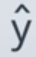

## Deep Learning

## Neural Networks

### Abbreviations

- **y**: Actual output
- : Predicted output

### Basics

- If there is inputs for n dimensional space: x1, x2, ...., xn then the decision boundary would be a n-1 dimensional hyper-plane.

## Perceptron

### Log-loss error function

- Error Function should be continuous and not discrete
- In order to do gradient descent:
  - Error function should be continuous
  - Error function should be differential
- To convert discrete function(step function), we can use sigmoid function
  - sigmoid(x) = 1/(1+exp(-x))

### Softmax function

> - Linear function score: z1, z2,... , zn
> - P(class i) = e^zi/(e^z1+e^z2+... + e^zn)

### One-Hot Encoding

> Convert categorical values to numerical with each category as a feature

### Maximum Likelihood

> Pick the model that gives the existing label highest probability, hence by maximizing the probability.

### Cross Entropy

> Context: Instead of multiplying probability, we take log of product of probability which transforms it into sum of logs. ln(ab) = ln(a) + ln(b)
>
> 
>
> Since log of a number less than zero would be negative, we basically take negative log of products:
>
> -ln(ab) = -ln(a) -ln(b)
>
> This is called **Cross Entropy**.

- **Good model** will give low **cross entropy**
- **Bad Model** will give high **cross entropy**

> If we have a bunch of events and a bunch of probabilities , how likely is it those events happen based on the probabilities.? If it's very likely then we have small cross entropy, if it's unlikely then we have a large cross entropy.

- **Cross Entropy** for binary class:

- Multi class **Cross Entropy**:

  

  ​

  ### Gradient Descent

  ​

### Logistic Regression

> Algorithm

## Deep Neural Networks

