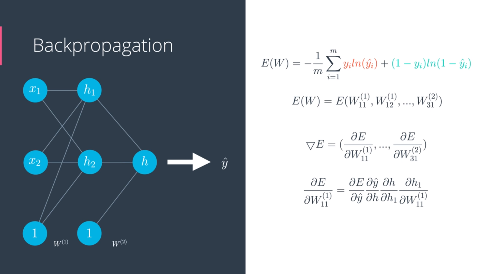
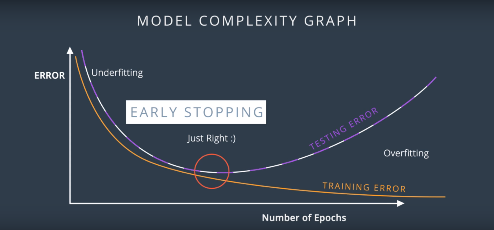
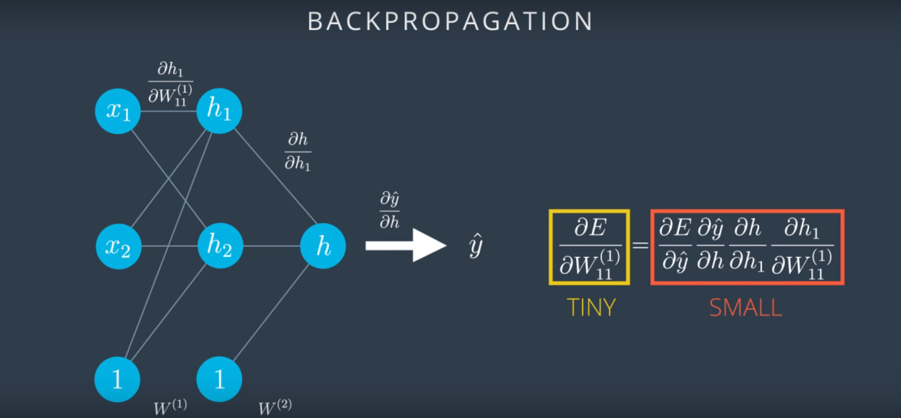
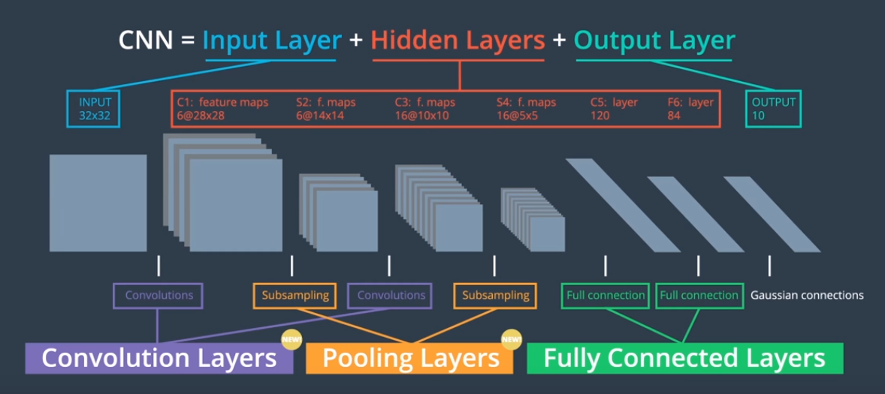
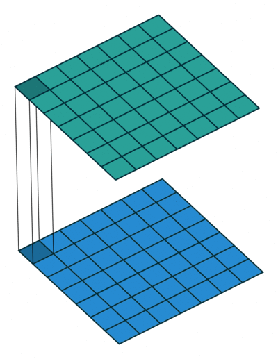

## Deep Learning


## Abbreviations

- MLP: Multi Layer Perceptrons
- CNN: Convolutional Neural Network
- **y**: Actual output
- : Predicted output

## Neural Networks


### Basics

- If there is inputs for n dimensional space: x1, x2, ...., xn then the decision boundary would be a n-1 dimensional hyper-plane.

## Perceptron


### Log-loss error function


- Error Function should be continuous and not discrete
- In order to do gradient descent:
  - Error function should be continuous
  - Error function should be differential
- To convert discrete function(step function), we can use sigmoid function
  - sigmoid(x) = 1/(1+exp(-x))


### Softmax function

> - Linear function score: z1, z2,... , zn
> - P(class i) = e^zi/(e^z1+e^z2+... + e^zn)


### One-Hot Encoding

> Convert categorical values to numerical with each category as a feature


### Maximum Likelihood

> Pick the model that gives the existing label highest probability, hence by maximizing the probability.


### Cross Entropy

> Context: Instead of multiplying probability, we take log of product of probability which transforms it into sum of logs. ln(ab) = ln(a) + ln(b)
>
> 
>
> Since log of a number less than zero would be negative, we basically take negative log of products:
>
> -ln(ab) = -ln(a) -ln(b)
>
> This is called **Cross Entropy**.

- **Good model** will give low **cross entropy**
- **Bad Model** will give high **cross entropy**

> If we have a bunch of events and a bunch of probabilities , how likely is it those events happen based on the probabilities.? If it's very likely then we have small cross entropy, if it's unlikely then we have a large cross entropy.

- **Cross Entropy** for binary class:


- Multi class **Cross Entropy**:

  

  ​

  ### Gradient Descent

  ​


We calculate the change in error with respect to different weights and bias units.

The sum of this change will give the resultant direction in which change will happen. We take negative of the resultant direction because we want to decrease the error and not increase it.

### Logistic Regression


> Algorithm


## Deep Neural Networks

### Feed Forward

### Backpropagation


> Backpropagation is like calculating  error at output layer with respect to all the weights, one at a time.




### Model Complexity Graph




### Regularization


- It's harder to do gradient descent in case of second graph since the curve is steep(overfitting) and the derivatives are mostly close to zero and very large when get to the middle of the curve
- Model in the left is preferred in order to do gradient descent properly


> Lambda -> Regularization parameter

- L1 regularization: 
  - We end up with sparse vector means small weight will tend to go to zero.
  - Good for feature selection as it can remove less important feature.
- L2 regularization:
  - Tries to maintain all the weights homogenously small
  - Better result for training models
  - ​


### Dropout


> We turn off some nodes in each epoch so as to give all nodes(perceptron)  equal treatment in deciding the outcome


### Local Minima 

> Gradient descent can suffer from local minima


### Vanishing gradient

- Sigmoid function gets pretty flat on sides.
- So if we take derivatives at a point way at the right or way at the left, it's almost zero.
- This is not good as the derivative is what tells us the direction in which we should move to make the error small.
- This gets worse in most linear perceptrons.




- Since gradient descent will take very very tiny step we might never be able to go reach global minima.

### Other activation functions

The best way to overcome the problem of vanishing gradient is to use other activation functions such as:

- Hyperbolic tangent function (tanh): 

  - This is similar to sigmod but our range is between -1 to 1 which has made great impact in advancements of neural network since derivatives are larger(hence direction of descent is well)

  

  ​

- Rectified Linear Unit (RELU):

  


Now with better activation function, the derivative would be ok and hence allowing us to do gradient descent.

Now we can have relu in middle and sigmoid at last layer.


If we replace sigmoid at last with relu then we will have regression model, the predictive value obtained.

### Batch vs Stochastic

**Batch Gradient Descent**:  Run each epoch through all the data set

**Stochastic Gradient Descent**: Split the data in sub set and run each epoch through one of the subset

### Learning Rate

> Rule of thumb: If your model is not working, decrease the learning rate

learning-rate-2.png


>  Best learning rate are those which decrease as model gets closer to a solution.


### Random Restart

One way to solve **local minimum** is use random restart: We start from few different places and do gradient descent from all the places, this usually increases the probability of getting global minima or pretty much good local minima.


### Momentum

- Momentum is like pushing through when stuck in local minima.
- Beta ranges from 0 to 1
- Next step is determined by weighted average of previous steps where weight fcator is 1, beta, beta^2 and so on.


[Overview of gradient descent optimization algorithm](http://ruder.io/optimizing-gradient-descent/index.html)

[Keras Optimizers](https://keras.io/optimizers/)

### Neural Network Regression

If we remove final layer activation function we can get regression instead of classification.

We can use mean squared error function here and back propagate the error.

### [Visual interactive Guide to Neural Network](http://jalammar.github.io/visual-interactive-guide-basics-neural-networks/)


## Convolutional Neural network





> Overfitting is detected by comparing the validation loss to the training loss. If the training loss is much lower than the validation loss, then the model might be overfitting.

[Systematic Hyperparameter Search](https://machinelearningmastery.com/grid-search-hyperparameters-deep-learning-models-python-keras/)


### Local Connectivity


- In **Convolutional layer**, we select a width and height that defines **convolutional window**. Then we slide the window horizontally and vertically. At each position, the window specifies a small piece within the image and defines a collection of pixels to which we connect a single hidden node.  The hidden layer is called **Convolutional Layer**.


- **Filter**: A grid with same height and width as **Convolutional Window** which represents weight of each element in **Convolutional window**.


[Create Filter](http://setosa.io/ev/image-kernels/)


- **Stride**: The amount by which **Filter** is moved.

- **Padding**:  Whether to pad the layer with empty data so as to let the filter cover all data or not.

  

  

- **Convolution with 3x3 swindow and stride 1**


- **Convolution with 1x1 window and stride 1**



- [one by one Convolution](http://iamaaditya.github.io/2016/03/one-by-one-convolution/)

- [Convolution Doc Keras](https://keras.io/layers/convolutional/)

- [Examples](https://classroom.udacity.com/nanodegrees/nd009-InMA2/parts/48128b20-ebca-4cfc-a25f-7156557a4ef5/modules/07527e23-347e-4fd8-b78f-6879d6d54e2d/lessons/63d583c5-a6bb-4d6f-b48e-d20c4797af85/concepts/5e62ce5f-26bb-4f84-91c1-4791b9d3aa53)

- **Number of parameters in Convolutional Layer**(keras) = **K* F * F * D_in + K**, Where:

  - `K` - the number of filters in the convolutional layer

  - `F` - the height and width of the convolutional filters

  - `D_in` - the depth of the previous layer

  - Last addition of `K` represents bias term per filter

    ​

- **Pooling Layer**: Reduces Dimensionality

  

  

  

[CS231 CNN](http://cs231n.github.io/convolutional-networks/)

**Max pooling with 2x2 window and stride 2**


#### Max Pooling Layers in Keras

To create a max pooling layer in Keras, you must first import the necessary module:

```
from keras.layers import MaxPooling2D
```

Then, you can create a convolutional layer by using the following format:

```
MaxPooling2D(pool_size, strides, padding)
```

#### Arguments

You must include the following argument:

- `pool_size` - Number specifying the height and width of the pooling window.

There are some additional, optional arguments that you might like to tune:

- `strides` - The vertical and horizontal stride. If you don't specify anything, `strides` will default to `pool_size`.
- `padding` - One of `'valid'` or `'same'`. If you don't specify anything, `padding` is set to `'valid'`.

**NOTE**: It is possible to represent both `pool_size` and `strides` as either a number or a tuple.

You are also encouraged to read the official [documentation](https://keras.io/layers/pooling/#maxpooling2d).

### CNN for Image Classification


Just as with neural networks, we create a CNN in Keras by first creating a `Sequential` model.

```
from keras.models import Sequential
```

We import several layers, including layers that are familiar from neural networks, and new layers that we learned about in this lesson.

```
from keras.layers import Conv2D, MaxPooling2D, Flatten, Dense
```

As with neural networks, we add layers to the network by using the `.add()` method:

```
model = Sequential()
model.add(Conv2D(filters=16, kernel_size=2, padding='same', activation='relu', input_shape=(32, 32, 3)))
model.add(MaxPooling2D(pool_size=2))
model.add(Conv2D(filters=32, kernel_size=2, padding='same', activation='relu'))
model.add(MaxPooling2D(pool_size=2))
model.add(Conv2D(filters=64, kernel_size=2, padding='same', activation='relu'))
model.add(MaxPooling2D(pool_size=2))
model.add(Flatten())
model.add(Dense(500, activation='relu'))
model.add(Dense(10, activation='softmax'))
```

The network begins with a sequence of three convolutional layers, followed by max pooling layers. These first six layers are designed to take the input array of image pixels and convert it to an array where all of the spatial information has been squeezed out, and only information encoding the content of the image remains. The array is then flattened to a vector in the seventh layer of the CNN. It is followed by two dense layers designed to further elucidate the content of the image. The final layer has one entry for each object class in the dataset, and has a softmax activation function, so that it returns probabilities.

**NOTE**: In the video, you might notice that convolutional layers are specified with `Convolution2D`instead of `Conv2D`. Either is fine for Keras 2.0, but `Conv2D` is preferred.

### Things to Remember

- Always add a ReLU activation function to the `Conv2D` layers in your CNN. With the exception of the final layer in the network, `Dense` layers should also have a ReLU activation function.
- When constructing a network for classification, the final layer in the network should be a `Dense`layer with a softmax activation function. The number of nodes in the final layer should equal the total number of classes in the dataset.
- Have fun! If you start to feel discouraged, we recommend that you check out [Andrej Karpathy's tumblr](https://lossfunctions.tumblr.com/) with user-submitted loss functions, corresponding to models that gave their owners some trouble. Recall that the loss is supposed to decrease during training. These plots show very different behavior :).


**Resources**

- [Keras cheat sheet](https://s3.amazonaws.com/assets.datacamp.com/blog_assets/Keras_Cheat_Sheet_Python.pdf)
- Read this [great blog post](http://machinelearningmastery.com/image-augmentation-deep-learning-keras/) that visualizes augmentations of the MNIST dataset.
- Check out this [detailed implementation](https://blog.keras.io/building-powerful-image-classification-models-using-very-little-data.html) that uses augmentation to boost performance on a Kaggle dataset.
- Read the Keras [documentation](https://keras.io/preprocessing/image/) on the ImageDataGenerator class.


### Visualizing CNN

### (REALLY COOL) Optional Resources

If you would like to know more about interpreting CNNs and convolutional layers in particular, you are encouraged to check out these resources:

- Here's a [section](http://cs231n.github.io/understanding-cnn/) from the Stanford's CS231n course on visualizing what CNNs learn.
- Check out this [demonstration](https://aiexperiments.withgoogle.com/what-neural-nets-see) of a cool [OpenFrameworks](http://openframeworks.cc/) app that visualizes CNNs in real-time, from user-supplied video!
- Here's a [demonstration](https://www.youtube.com/watch?v=AgkfIQ4IGaM&t=78s) of another visualization tool for CNNs. If you'd like to learn more about how these visualizations are made, check out this [video](https://www.youtube.com/watch?v=ghEmQSxT6tw&t=5s).
- Here's [another visualization tool](https://medium.com/merantix/picasso-a-free-open-source-visualizer-for-cnns-d8ed3a35cfc5) that seamlessly works with CNNs in Keras and Tensorflow.
- Read this [Keras blog post](https://blog.keras.io/how-convolutional-neural-networks-see-the-world.html) on visualizing how CNNs see the world. In this post, you can find an accessible introduction to Deep Dreams, along with code for writing your own deep dreams in Keras. When you've read that:
  - Also check out this [music video](https://www.youtube.com/watch?v=XatXy6ZhKZw) that makes use of Deep Dreams (look at 3:15-3:40)!
  - Create your own Deep Dreams (without writing any code!) using this [website](https://deepdreamgenerator.com/).
- If you'd like to read more about interpretability of CNNs,
  - here's an [article](https://blog.openai.com/adversarial-example-research/) that details some dangers from using deep learning models (that are not yet interpretable) in real-world applications.
  - there's a lot of active research in this area. [These authors](https://arxiv.org/abs/1611.03530) recently made a step in the right direction.

Let’s look at an example CNN to see how it works in action.

The CNN we will look at is trained on ImageNet as described in [this paper](http://www.matthewzeiler.com/pubs/arxive2013/eccv2014.pdf) by Zeiler and Fergus. In the images below (from the same paper), we’ll see *what* each layer in this network detects and see *how* each layer detects more and more complex ideas.

[Example patterns that cause activations in the first layer of the network. These range from simple diagonal lines (top left) to green blobs (bottom middle).](https://classroom.udacity.com/nanodegrees/nd009-InMA2/parts/48128b20-ebca-4cfc-a25f-7156557a4ef5/modules/07527e23-347e-4fd8-b78f-6879d6d54e2d/lessons/63d583c5-a6bb-4d6f-b48e-d20c4797af85/concepts/cbf65dc4-c0b4-44c5-81c6-5997e409cb75#)

The images above are from Matthew Zeiler and Rob Fergus' [deep visualization toolbox](https://www.youtube.com/watch?v=ghEmQSxT6tw), which lets us visualize what each layer in a CNN focuses on.

Each image in the above grid represents a pattern that causes the neurons in the first layer to activate - in other words, they are patterns that the first layer recognizes. The top left image shows a -45 degree line, while the middle top square shows a +45 degree line. These squares are shown below again for reference.

[As visualized here, the first layer of the CNN can recognize -45 degree lines.](https://classroom.udacity.com/nanodegrees/nd009-InMA2/parts/48128b20-ebca-4cfc-a25f-7156557a4ef5/modules/07527e23-347e-4fd8-b78f-6879d6d54e2d/lessons/63d583c5-a6bb-4d6f-b48e-d20c4797af85/concepts/cbf65dc4-c0b4-44c5-81c6-5997e409cb75#)

[The first layer of the CNN is also able to recognize +45 degree lines, like the one above.](https://classroom.udacity.com/nanodegrees/nd009-InMA2/parts/48128b20-ebca-4cfc-a25f-7156557a4ef5/modules/07527e23-347e-4fd8-b78f-6879d6d54e2d/lessons/63d583c5-a6bb-4d6f-b48e-d20c4797af85/concepts/cbf65dc4-c0b4-44c5-81c6-5997e409cb75#)

Let's now see some example images that cause such activations. The below grid of images all activated the -45 degree line. Notice how they are all selected despite the fact that they have different colors, gradients, and patterns.

[Example patches that activate the -45 degree line detector in the first layer.](https://classroom.udacity.com/nanodegrees/nd009-InMA2/parts/48128b20-ebca-4cfc-a25f-7156557a4ef5/modules/07527e23-347e-4fd8-b78f-6879d6d54e2d/lessons/63d583c5-a6bb-4d6f-b48e-d20c4797af85/concepts/cbf65dc4-c0b4-44c5-81c6-5997e409cb75#)

So, the first layer of our CNN clearly picks out very simple shapes and patterns like lines and blobs.

### Layer 2

[A visualization of the second layer in the CNN. Notice how we are picking up more complex ideas like circles and stripes. The gray grid on the left represents how this layer of the CNN activates (or "what it sees") based on the corresponding images from the grid on the right.](https://classroom.udacity.com/nanodegrees/nd009-InMA2/parts/48128b20-ebca-4cfc-a25f-7156557a4ef5/modules/07527e23-347e-4fd8-b78f-6879d6d54e2d/lessons/63d583c5-a6bb-4d6f-b48e-d20c4797af85/concepts/cbf65dc4-c0b4-44c5-81c6-5997e409cb75#)

The second layer of the CNN captures complex ideas.

As you see in the image above, the second layer of the CNN recognizes circles (second row, second column), stripes (first row, second column), and rectangles (bottom right).

**The CNN learns to do this on its own.** There is no special instruction for the CNN to focus on more complex objects in deeper layers. That's just how it normally works out when you feed training data into a CNN.

### Layer 3

[A visualization of the third layer in the CNN. The gray grid on the left represents how this layer of the CNN activates (or "what it sees") based on the corresponding images from the grid on the right.](https://classroom.udacity.com/nanodegrees/nd009-InMA2/parts/48128b20-ebca-4cfc-a25f-7156557a4ef5/modules/07527e23-347e-4fd8-b78f-6879d6d54e2d/lessons/63d583c5-a6bb-4d6f-b48e-d20c4797af85/concepts/cbf65dc4-c0b4-44c5-81c6-5997e409cb75#)

The third layer picks out complex combinations of features from the second layer. These include things like grids, and honeycombs (top left), wheels (second row, second column), and even faces (third row, third column).

We'll skip layer 4, which continues this progression, and jump right to the fifth and final layer of this CNN.

### Layer 5

[A visualization of the fifth and final layer of the CNN. The gray grid on the left represents how this layer of the CNN activates (or "what it sees") based on the corresponding images from the grid on the right.](https://classroom.udacity.com/nanodegrees/nd009-InMA2/parts/48128b20-ebca-4cfc-a25f-7156557a4ef5/modules/07527e23-347e-4fd8-b78f-6879d6d54e2d/lessons/63d583c5-a6bb-4d6f-b48e-d20c4797af85/concepts/cbf65dc4-c0b4-44c5-81c6-5997e409cb75#)

The last layer picks out the highest order ideas that we care about for classification, like dog faces, bird faces, and bicycles.


### Transfer Learning

Transfer learning involves taking a pre-trained neural network and adapting the neural network to a new, different data set.

Depending on both:

- the size of the new data set, and
- the similarity of the new data set to the original data set

the approach for using transfer learning will be different. There are four main cases:

1. new data set is small, new data is similar to original training data
2. new data set is small, new data is different from original training data
3. new data set is large, new data is similar to original training data
4. new data set is large, new data is different from original training data

[Four Cases when Using Transfer Learning](https://classroom.udacity.com/nanodegrees/nd009-InMA2/parts/48128b20-ebca-4cfc-a25f-7156557a4ef5/modules/07527e23-347e-4fd8-b78f-6879d6d54e2d/lessons/63d583c5-a6bb-4d6f-b48e-d20c4797af85/concepts/8c202ff3-aab5-46c3-8ed1-0154fa7b566b#)

A large data set might have one million images. A small data could have two-thousand images. The dividing line between a large data set and small data set is somewhat subjective. Overfitting is a concern when using transfer learning with a small data set.

Images of dogs and images of wolves would be considered similar; the images would share common characteristics. A data set of flower images would be different from a data set of dog images.

Each of the four transfer learning cases has its own approach. In the following sections, we will look at each case one by one.

### Demonstration Network

To explain how each situation works, we will start with a generic pre-trained convolutional neural network and explain how to adjust the network for each case. Our example network contains three convolutional layers and three fully connected layers:

[General Overview of a Neural Network](https://classroom.udacity.com/nanodegrees/nd009-InMA2/parts/48128b20-ebca-4cfc-a25f-7156557a4ef5/modules/07527e23-347e-4fd8-b78f-6879d6d54e2d/lessons/63d583c5-a6bb-4d6f-b48e-d20c4797af85/concepts/8c202ff3-aab5-46c3-8ed1-0154fa7b566b#)

Here is an generalized overview of what the convolutional neural network does:

- the first layer will detect edges in the image
- the second layer will detect shapes
- the third convolutional layer detects higher level features

Each transfer learning case will use the pre-trained convolutional neural network in a different way.

### Case 1: Small Data Set, Similar Data

[Case 1: Small Data Set with Similar Data](https://classroom.udacity.com/nanodegrees/nd009-InMA2/parts/48128b20-ebca-4cfc-a25f-7156557a4ef5/modules/07527e23-347e-4fd8-b78f-6879d6d54e2d/lessons/63d583c5-a6bb-4d6f-b48e-d20c4797af85/concepts/8c202ff3-aab5-46c3-8ed1-0154fa7b566b#)

If the new data set is small and similar to the original training data:

- slice off the end of the neural network
- add a new fully connected layer that matches the number of classes in the new data set
- randomize the weights of the new fully connected layer; freeze all the weights from the pre-trained network
- train the network to update the weights of the new fully connected layer

To avoid overfitting on the small data set, the weights of the original network will be held constant rather than re-training the weights.

Since the data sets are similar, images from each data set will have similar higher level features. Therefore most or all of the pre-trained neural network layers already contain relevant information about the new data set and should be kept.

Here's how to visualize this approach:

[Neural Network with Small Data Set, Similar Data](https://classroom.udacity.com/nanodegrees/nd009-InMA2/parts/48128b20-ebca-4cfc-a25f-7156557a4ef5/modules/07527e23-347e-4fd8-b78f-6879d6d54e2d/lessons/63d583c5-a6bb-4d6f-b48e-d20c4797af85/concepts/8c202ff3-aab5-46c3-8ed1-0154fa7b566b#)

### Case 2: Small Data Set, Different Data

[Case 2: Small Data Set, Different Data](https://classroom.udacity.com/nanodegrees/nd009-InMA2/parts/48128b20-ebca-4cfc-a25f-7156557a4ef5/modules/07527e23-347e-4fd8-b78f-6879d6d54e2d/lessons/63d583c5-a6bb-4d6f-b48e-d20c4797af85/concepts/8c202ff3-aab5-46c3-8ed1-0154fa7b566b#)

If the new data set is small and different from the original training data:

- slice off most of the pre-trained layers near the beginning of the network
- add to the remaining pre-trained layers a new fully connected layer that matches the number of classes in the new data set
- randomize the weights of the new fully connected layer; freeze all the weights from the pre-trained network
- train the network to update the weights of the new fully connected layer

Because the data set is small, overfitting is still a concern. To combat overfitting, the weights of the original neural network will be held constant, like in the first case.

But the original training set and the new data set do not share higher level features. In this case, the new network will only use the layers containing lower level features.

Here is how to visualize this approach:

[Neural Network with Small Data Set, Different Data](https://classroom.udacity.com/nanodegrees/nd009-InMA2/parts/48128b20-ebca-4cfc-a25f-7156557a4ef5/modules/07527e23-347e-4fd8-b78f-6879d6d54e2d/lessons/63d583c5-a6bb-4d6f-b48e-d20c4797af85/concepts/8c202ff3-aab5-46c3-8ed1-0154fa7b566b#)

### Case 3: Large Data Set, Similar Data

[Case 3: Large Data Set, Similar Data](https://classroom.udacity.com/nanodegrees/nd009-InMA2/parts/48128b20-ebca-4cfc-a25f-7156557a4ef5/modules/07527e23-347e-4fd8-b78f-6879d6d54e2d/lessons/63d583c5-a6bb-4d6f-b48e-d20c4797af85/concepts/8c202ff3-aab5-46c3-8ed1-0154fa7b566b#)

If the new data set is large and similar to the original training data:

- remove the last fully connected layer and replace with a layer matching the number of classes in the new data set
- randomly initialize the weights in the new fully connected layer
- initialize the rest of the weights using the pre-trained weights
- re-train the entire neural network

Overfitting is not as much of a concern when training on a large data set; therefore, you can re-train all of the weights.

Because the original training set and the new data set share higher level features, the entire neural network is used as well.

Here is how to visualize this approach:

[Neural Network with Large Data Set, Similar Data](https://classroom.udacity.com/nanodegrees/nd009-InMA2/parts/48128b20-ebca-4cfc-a25f-7156557a4ef5/modules/07527e23-347e-4fd8-b78f-6879d6d54e2d/lessons/63d583c5-a6bb-4d6f-b48e-d20c4797af85/concepts/8c202ff3-aab5-46c3-8ed1-0154fa7b566b#)

### Case 4: Large Data Set, Different Data

[Case 4: Large Data Set, Different Data](https://classroom.udacity.com/nanodegrees/nd009-InMA2/parts/48128b20-ebca-4cfc-a25f-7156557a4ef5/modules/07527e23-347e-4fd8-b78f-6879d6d54e2d/lessons/63d583c5-a6bb-4d6f-b48e-d20c4797af85/concepts/8c202ff3-aab5-46c3-8ed1-0154fa7b566b#)

If the new data set is large and different from the original training data:

- remove the last fully connected layer and replace with a layer matching the number of classes in the new data set
- retrain the network from scratch with randomly initialized weights
- alternatively, you could just use the same strategy as the "large and similar" data case

Even though the data set is different from the training data, initializing the weights from the pre-trained network might make training faster. So this case is exactly the same as the case with a large, similar data set.

If using the pre-trained network as a starting point does not produce a successful model, another option is to randomly initialize the convolutional neural network weights and train the network from scratch.

Here is how to visualize this approach:

[Neural Network with Large Data Set, Different Data](https://classroom.udacity.com/nanodegrees/nd009-InMA2/parts/48128b20-ebca-4cfc-a25f-7156557a4ef5/modules/07527e23-347e-4fd8-b78f-6879d6d54e2d/lessons/63d583c5-a6bb-4d6f-b48e-d20c4797af85/concepts/8c202ff3-aab5-46c3-8ed1-0154fa7b566b#)

### Optional Resources

- Check out this [research paper](https://arxiv.org/pdf/1411.1792.pdf) that systematically analyzes the transferability of features learned in pre-trained CNNs.
- Read the [Nature publication](http://www.nature.com/articles/nature21056.epdf?referrer_access_token=_snzJ5POVSgpHutcNN4lEtRgN0jAjWel9jnR3ZoTv0NXpMHRAJy8Qn10ys2O4tuP9jVts1q2g1KBbk3Pd3AelZ36FalmvJLxw1ypYW0UxU7iShiMp86DmQ5Sh3wOBhXDm9idRXzicpVoBBhnUsXHzVUdYCPiVV0Slqf-Q25Ntb1SX_HAv3aFVSRgPbogozIHYQE3zSkyIghcAppAjrIkw1HtSwMvZ1PXrt6fVYXt-dvwXKEtdCN8qEHg0vbfl4_m&tracking_referrer=edition.cnn.com) detailing Sebastian Thrun's cancer-detecting CNN!


- Here's the [first research paper](http://cnnlocalization.csail.mit.edu/Zhou_Learning_Deep_Features_CVPR_2016_paper.pdf) to propose GAP layers for object localization.
- Check out this [repository](https://github.com/alexisbcook/ResNetCAM-keras) that uses a CNN for object localization.
- Watch this [video demonstration](https://www.youtube.com/watch?v=fZvOy0VXWAI) of object localization with a CNN.
- Check out this [repository](https://github.com/alexisbcook/keras_transfer_cifar10) that uses visualization techniques to better understand bottleneck features.

### Sensitivity(Recall)

>  Of all the sick people, how many did we diagnose sick

### Specificity (not Precision)

> Of all the healthy people how many did we diagnose healthy

# Sensitivity and Specificity

Although similar, *sensitivity* and *specificity* are not the same as *precision* and *recall*. Here are the definitions:

In the cancer example, sensitivity and specificity are the following:

- Sensitivity: Of all the people **with** cancer, how many were correctly diagnosed?
- Specificity: Of all the people **without** cancer, how many were correctly diagnosed?

And precision and recall are the following:

- Recall: Of all the people who **have cancer**, how many did **we diagnose** as having cancer?
- Precision: Of all the people **we diagnosed** with cancer, how many actually **had cancer**?

From here we can see that Sensitivity is Recall, and the other two are not the same thing.

Trust me, we also have a hard time remembering which one is which, so here's a little trick. If you remember from Luis's Evaluation Metrics section, here is the [confusion matrix](https://classroom.udacity.com/nanodegrees/nd009-InMA2/parts/48128b20-ebca-4cfc-a25f-7156557a4ef5/modules/07527e23-347e-4fd8-b78f-6879d6d54e2d/lessons/59da07ce-6010-455e-be9a-b61d8f463f92/concepts/-%20):

[](https://classroom.udacity.com/nanodegrees/nd009-InMA2/parts/48128b20-ebca-4cfc-a25f-7156557a4ef5/modules/07527e23-347e-4fd8-b78f-6879d6d54e2d/lessons/59da07ce-6010-455e-be9a-b61d8f463f92/concepts/c225888e-8e82-4020-a641-acdda4008fa5#)

Now, sensitivity and specificity are the rows of this matrix. More specifically, if we label

- TP: (True Positives) Sick people that we **correctly** diagnosed as sick.
- TN: (True Negatives) Healthy people that we **correctly** diagnosed as healthy.
- FP: (False Positives) Healthy people that we **incorrectly** diagnosed as sick.
- FN: (False Negatives) Sick people that we **incorrectly** diagnosed as healthy.

then:

Sensitivity = {TP}/{TP + FN}=TP+FNTP

and

Specificity = {TN}/{TN + FP}=TN+FPTN.

[Sensitivity and Specificity](https://classroom.udacity.com/nanodegrees/nd009-InMA2/parts/48128b20-ebca-4cfc-a25f-7156557a4ef5/modules/07527e23-347e-4fd8-b78f-6879d6d54e2d/lessons/59da07ce-6010-455e-be9a-b61d8f463f92/concepts/c225888e-8e82-4020-a641-acdda4008fa5#)

And precision and recall are the top row and the left column of the matrix:

Recall = {TP}/{TP + FN}=TP+FNTP

and

Precision = {TP}/{TP + FP}=TP+FPTP.

[Precision and Recall](https://classroom.udacity.com/nanodegrees/nd009-InMA2/parts/48128b20-ebca-4cfc-a25f-7156557a4ef5/modules/07527e23-347e-4fd8-b78f-6879d6d54e2d/lessons/59da07ce-6010-455e-be9a-b61d8f463f92/concepts/c225888e-8e82-4020-a641-acdda4008fa5#)

### ROC Curve

### Confusion Matrix

- False Positive - Type 1 Error
- False Negative - Type 2 Error

# Useful Resources

[](https://classroom.udacity.com/nanodegrees/nd009-InMA2/parts/48128b20-ebca-4cfc-a25f-7156557a4ef5/modules/07527e23-347e-4fd8-b78f-6879d6d54e2d/lessons/59da07ce-6010-455e-be9a-b61d8f463f92/concepts/23124cbb-77e8-4f8c-aaf4-c27b809c82ea#)

Here's the publication in [Nature](https://www.nature.com/articles/nature21056.epdf?author_access_token=8oxIcYWf5UNrNpHsUHd2StRgN0jAjWel9jnR3ZoTv0NXpMHRAJy8Qn10ys2O4tuPakXos4UhQAFZ750CsBNMMsISFHIKinKDMKjShCpHIlYPYUHhNzkn6pSnOCt0Ftf6).

Other articles:

- [Fortune Magazine](http://fortune.com/2017/01/26/stanford-ai-skin-cancer/)
- [Bloomberg](https://www.bloomberg.com/news/articles/2017-06-29/diagnosing-skin-cancer-with-google-images)
- [BBC](http://www.bbc.com/news/health-38717928)
- [Wall Street Journal](https://www.wsj.com/articles/computers-turn-medical-sleuths-and-identify-skin-cancer-1486740634?emailToken=JRrzcPt+aXiegNA9bcw301gwc7UFEfTMWk7NKjXPN0TNv3XR5Pmlyrgph8DyqGWjAEd26tYY7mAuACbSgWwvV8aXkLNl1A74KycC8smailE=)
- [Forbes](https://www.forbes.com/sites/forbestechcouncil/2017/09/27/what-can-computer-vision-do-in-the-palm-of-your-hand/#4d2c686847a7)
- [Scientific American](https://www.scientificamerican.com/article/deep-learning-networks-rival-human-vision1/)

