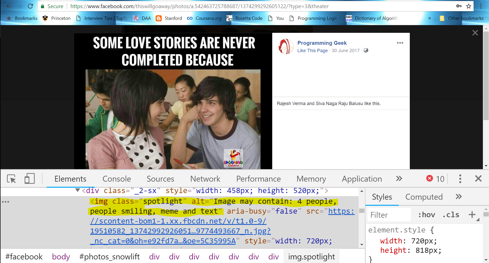

# Machine Learning Engineer Nanodegree
## Capstone Proposal
Vikash Verma  
September 6th, 2018

## Proposal
Flowers Recognition

### Domain Background

Learning is an inherent instinct of Human being. We learn by remembering the context. On encountering a similar context we apply the action which was deemed positive.

Machine can also be made to learn. A well trained machine learning model can also apply the context on a new situation and try to generate meaningful information.

E.g. Facebook applies Machine Learning on each and every image and try to provide meaningful insights on that as shown in following picture.

If you look closely at the picture above you can figure out that Facebook tries to automatically add contextual information to every picture:

 - People
 - Smiling
 - Meme
 - Text

In modern world, it is becoming increasingly important to get contextual information. In this proposed project, we try to classify different category of flower. 

### Problem Statement

The objective this project to correctly classify an image in one of the five category of the flower.

Although there are many more categories of flowers, here we are focusing on only five flower categories viz. **Sunflower, Dandelion, Tulip, Daisy and Rose**

For a new category of image we try to predict to closely resembling category out of these five category.

Potential applications are huge.

- Imagine how Google shows sunflower images when searched for **sunflower images**. 
- Imagine asking Alexa to send a rose to loved ones.
- Automated recommendation of different design from flowers on different occasion.
  - **Congratulatory**:  A combination of flowers
  - **Expressing Love**: Red Roses
  - **Funeral**: White Lilies

### Datasets and Inputs
The dataset is available on [Kaggle](https://www.kaggle.com/alxmamaev/flowers-recognition). The data is scraped from Flickr, Google images and Yandex images.

The dataset contains five kinds of flower's  images.

 - Daisy

 - Dandelion

 - Rose

 - Sunflower

 - Tulip

   ​

   The flowers are present in dataset as follows: 

   --flowers

   ​	-- Daisy

   ​	-- Dandelion

   ​	-- Sunflower

   ​	-- Tulip

   ​

### Solution Statement

There are multiple ways for classification.  Here we can use a CNN to classify flowers. A CNN from scratch might take longer to run but it can provide valuable insights quickly. We can also use Transfer Learning from Keras to create a new model and train this model on this data. Using Transfer Learning can help reach greater accuracy.

### Benchmark Model
There are two benchmark model we can use.

 - Kaggle: Best score from Kaggle
 - Imagenet: We can use pre trained model on Imagenet dataset to predict a particular flower category. Since there is only one flower category (daisy) out of 1000 in imagenet, we can use the accuracy of predicting daisy from this model as benchmark.

### Evaluation Metrics

We can use accuracy as the evaluation metrics.

Since the dataset is divide into three sets viz. training, validation and testing. We can use accuracy on testing set as an evaluation metrics.

### Project Design

The project is designed in following ways:

- Create a **data** and three subdirectory in it viz. **train**, **valid** and **test**
- Move 60% of images of each category to **train** directory, 20% to valid and 20% to test
- Now we have flower dataset for training, validation and testing
- Load dataset in memory for training, validation and testing.
- Resize all images to same size and create 4D tensor to be supllied to Keras CNN
- Use daisy flowers to evaluate the performance of Keras model such as ResNet50 to get the benchmark accuracy.
- We can implement the model in two ways
  - Building a CNN from scratch
    - Create a CNN architecture from Scratch and train the model. Save the best model weights during training.
    - Load the best model weight
    - Use the testing set to get resulting accuracy.
  - Transfer Learning
    - Use on of the pre trained  Keras model for transfer learning
    - Load the best model weight
    - Use the testing set to get the accuracy of the model

### References

- [Keras](https://keras.io/)
- [Kaggle](https://www.kaggle.com/alxmamaev/flowers-recognition)
- [Facebook](https://www.facebook.com/)