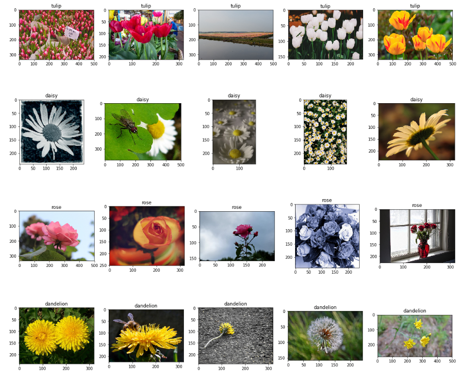
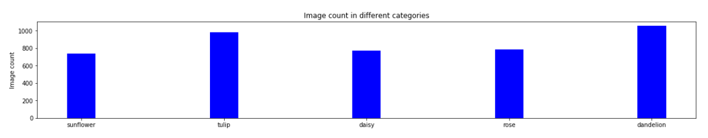
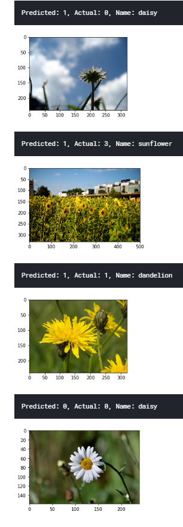

# Machine Learning Engineer Nanodegree
## Capstone Project
Vikash Verma  
September 10th, 2018

## I. Definition
Flowers Recognition

### Project Overview

This project aims to predict the category of a flower among five categories viz. `rose`, `tulip`, `dandelion`, `daisy` and `sunflower`.

Flower plays an important role in our life. It depicts an expression of love, emotion and sympathy. Flower has important medicinal value as well. 

In today's world, getting contextual information from data is very important. We as an human are very fast in getting contextual information from picture, voice or surroundings.

- We can clearly figure out the content from a picture. E.g. we can recognize a person if we have seen him before.
- We can somewhat figure out the person speaking over the phone if we have talked before to him.
- We can guess the content of the picture from an incomplete or broken image.
- We can figure out the sense from the text even if there are grammatical or spelling mistakes.

Although machine's are very fast in processing information they are not intelligent enough in getting contextual information.

Recent advances in Machine Learning has enabled machine to learn and get the context out of an environment.


In this project we try to see how a machine can be trained from the data to categorize a flower provided an image.


### Problem Statement
The objective of this project is to classify an image in one of the five categories viz. `rose`, `tulip`, `dandelion`, `daisy` and `sunflower`.

For a new image, the idea is to predict the category which closely resembles to the image.

There are multiple ways to train the machine learning model. Here we will see a basic model, a model from scratch and a model using Transfer Learning.


### Metrics
We can divide the dataset into three sets viz. `training`, `validation` and `testing` with 60%, 20% and 20% data in each categories respectively.

- The `training` set is used for training the model.
- The `validation` set is used for validating the trained model.
- The `testing` set is used for testing the model in unseen data.


Here we choose `Accuracy` as a metric to evaluate the performance of the model.

`Accuracy = (true positive + true negative) / total size`

`Accuracy` is a good metric to evaluate the model when dataset is not imbalanced.  Here we have approximately similar number of images in each category hence `Accuracy` is fine to use as a metric. 


## II. Analysis


### Data Exploration

The dataset is available on [Kaggle](https://www.kaggle.com/alxmamaev/flowers-recognition). The data is scraped from Flickr, Google images and Yandex images.

The dataset contains five kinds of flower's  images.

- Daisy
- Dandelion
- Rose
- Sunflower
- Tulip


The flowers are present in dataset as follows: 

```
flowers
│
└───Daisy
│   
└───Dandelion
|
└───Rose
│   
└───Sunflower
|
└───Tulip
```

We can create dataset for training, validation and testing to easily use `load_files` from `sklearn` as follows:


```
data
│
└───train
|    │
|    └───Daisy
|    │   
|    └───Dandelion
|    |
|    └───Rose
|    │   
|    └───Sunflower
|    |
|    └───Tulip
└───valid
|    │
|    └───Daisy
|    │   
|    └───Dandelion
|    |
|    └───Rose
|    │   
|    └───Sunflower
|    |
|    └───Tulip
└───test
     │
     └───Daisy
     │   
     └───Dandelion
     |
     └───Rose
     │   
     └───Sunflower
     |
     └───Tulip
```

There are around 4323 images of five categories as follows:

- Sunflower: 734
- Tulip: 984
- Daisy: 769
- Rose: 784
- Dandelion: 1052

The dataset does not seems to be imbalanced. 


### Exploratory Visualization

Let's try to see some of the pictures from each category.



Number of images in different categories is visualized below.




Based on the visualization, it is obvious that we have pretty much similar number of images in each category.

### Algorithms and Techniques

There are multiple ways to implement the model to classify an image in one of the five category. In this project, we can develop

- A simple CNN as a benchmark model.
- A full fledged CNN from scratch
- A model using Transfer Learning.

A simple CNN will provide us a benchmark value for subsequent models. Based on this benchmark model, we can focus on our other model to perform better than that.

A full-fledged model from scratch might take long time to develop a fine tune it's parameter but it can give us important insights on how it is performing compared to benchmark model. Ideally it should perform better that benchmark model.

A model using transfer learning has most of it's parameter already tuned, this will run quite faster that a model from scratch of similar size. using transfer learning we can achieve greater accuracy on the testing set.


The project is designed in the following ways:

- Create a **data** and three subdirectory in it viz. **train**, **valid** and **test**
- Move 60% of images of each category to **train** directory, 20% to valid and 20% to test
- Now we have flower dataset for training, validation and testing
- Load dataset in memory for training, validation and testing.
- Resize all images to same size and create 4D tensor to be supllied to Keras CNN
- Use a simple CNN model to get the benchmark.
- We can implement the model in two ways
  - Building a CNN from scratch
    - Create a CNN architecture from Scratch and train the model. Save the best model weights during training.
    - Load the best model weight
    - Use the testing set to get resulting accuracy.
  - Transfer Learning
    - Use on of the pre trained  Keras model for transfer learning
    - Load the best model weight
    - Use the testing set to get the accuracy of the model

### Benchmark
A simple CNN is used for getting the benchmark accuracy.

The summary of the model is given below:

```
_________________________________________________________________
Layer (type)                 Output Shape              Param #   
=================================================================
conv2d_1 (Conv2D)            (None, 223, 223, 16)      208       
_________________________________________________________________
global_average_pooling2d_1 ( (None, 16)                0         
_________________________________________________________________
dense_1 (Dense)              (None, 5)                 85        
=================================================================
Total params: 293
Trainable params: 293
Non-trainable params: 0
_________________________________________________________________
```


On training this model, we get the benchmark accuracy of `43%`.


## III. Methodology
### Data Preprocessing
- As discussed in `Data Exploration` section, we divide the data in three categories viz. `training`, `validation` and `testing` set with 60%, 20% and 20% of data respectively.

- There are few unwanted python file which are remove during movement of data into `trainging`, `validation` and `testing` sets.

- All the images are not of same size, hence they are resized to same size.

- All the tensors created from the image data are rescaled.

  ​

### Implementation

Three models are implemented for this project:

- Benchmark model
- CNN model from scratch
- Transfer Learning Model


#### Benchmark model:

The model summary is as given below:

```
_________________________________________________________________
Layer (type)                 Output Shape              Param #   
=================================================================
conv2d_1 (Conv2D)            (None, 223, 223, 16)      208       
_________________________________________________________________
global_average_pooling2d_1 ( (None, 16)                0         
_________________________________________________________________
dense_1 (Dense)              (None, 5)                 85        
=================================================================
Total params: 293
Trainable params: 293
Non-trainable params: 0
_________________________________________________________________
```


This model receives training and validation tensors. This is trained for 50 epochs and the resulting accuracy on the testing set obtained is `43%`.


### CNN Model from scratch

The model summary is given below:

```
_________________________________________________________________
Layer (type)                 Output Shape              Param #   
=================================================================
conv2d_2 (Conv2D)            (None, 223, 223, 16)      208       
_________________________________________________________________
max_pooling2d_1 (MaxPooling2 (None, 111, 111, 16)      0         
_________________________________________________________________
conv2d_3 (Conv2D)            (None, 110, 110, 32)      2080      
_________________________________________________________________
max_pooling2d_2 (MaxPooling2 (None, 55, 55, 32)        0         
_________________________________________________________________
conv2d_4 (Conv2D)            (None, 54, 54, 64)        8256      
_________________________________________________________________
max_pooling2d_3 (MaxPooling2 (None, 27, 27, 64)        0         
_________________________________________________________________
global_average_pooling2d_2 ( (None, 64)                0         
_________________________________________________________________
dense_2 (Dense)              (None, 5)                 325       
=================================================================
Total params: 10,869
Trainable params: 10,869
Non-trainable params: 0
_________________________________________________________________
```


- A multilayer CNN model is developed from scratch.

- It receives 4D tensors of training and validation sets.

- This model is trained for 50 epochs.

- Best weights of the model among each epoch are saved.

- The best weights of the model is loaded into memory and run on testing set.

- The resulting accuracy obtained is 71`%`.

  ​

#### Transfer Learning Model

- `InceptionResNetV2` model is used for transfer learning.

- It receives 4D tensors of training and validation sets.
- This model is trained for 15 epochs.
- Best weights of the model among each epoch are saved.
- The best weights of the model is loaded into memory and run on testing set.
- The resulting accuracy obtained is `80%`.


Training the models for high number of epochs takes a lot of time without GPU. The models can be trained on Google Colab or Kaggle.


### Refinement
At first, a CNN model from scratch was implemented and run for 50 epochs. This model achieves around `71%` accuracy when run for 50 epochs.

An improved model is developed later using Transfer Learning. This model is run for 15 epochs which achieves greater accuracy of around `80%`.


## IV. Results
### Model Evaluation and Validation

| Metric   | Benchmark model | Model from scratch | Transfer Learning Model |
| -------- | --------------- | ------------------ | ----------------------- |
| Accuracy | 43%             | 70%                | 80%                     |

As it can bee seen from the table above that the Model using Transfer Learning performs significantly better than the benchmark model and the model from scratch.


### Justification

- The final model using Transfer Learning performs significantly better compared to the benchmark model.
- The Accuracy of final model is `71%` which is acceptable.
- Since the dataset is not imbalanced, accuracy is a good measure of the performance of the model.


## V. Conclusion
### Free-Form Visualization

A test run on new unseen images produces following result:



From the above image, we can infer that when

- the number of images in the picture are more, the model fails to predict the correct category.
- the image is blurred or not in focus, the model does not correctly categorize.
- the image is clearly in focus, the model can classify correctly.


### Reflection
- The project attempted to classify an image into one of the five categories viz. `rose`, `tulip`, `dandelion`, `daisy` and `sunflower`.
- A naïve model was developed to get the benchmark accuracy which was around `43%`.
- A full fledged CNN model was developed and trained for 50 epochs. This model achieves a better accuracy (`71%`) than benchmark model.
- Later a model using Transfer Learning is developed. This is trained for 15 epochs. This model outshines all other model with an accuracy of `80%`.
- Running the model without GPU takes significant amount of time. A free resource such as Google Colab or Kaggle can be used for training the model.


### Improvement

- There are around 4323 images of five categories which are gain split into training, validation and testing sets.
- The best model (using Transfer Learning) gave an accuracy of around `80%`. 
- Having more data is usually better.
- We can increase the number of images using image augmentation such as rotation, flipping etc.
- As the dataset will grow, the model will be better in generalizing.
- This will also emphasize that model is not remembering and actually learning.
- Here, we have only five category of images. We can use images from more categories to get a better generalization among all the flower categories.


### References

- [Cambridge Reserach](https://www.mrc-cbu.cam.ac.uk/people/matt.davis/cmabridge/)
- [Keras](https://keras.io/)
- [Kaggle](https://www.kaggle.com/alxmamaev/flowers-recognition)
- [Facebook](https://www.facebook.com/)
- [University of Oxford](http://www.robots.ox.ac.uk/~vgg/research/flowers_demo/)
- [IEEE](https://ieeexplore.ieee.org/document/8288453/)
- [Flower image classification modeling using neural network](https://www.researchgate.net/publication/281996446_Flower_image_classification_modeling_using_neural_network/references)