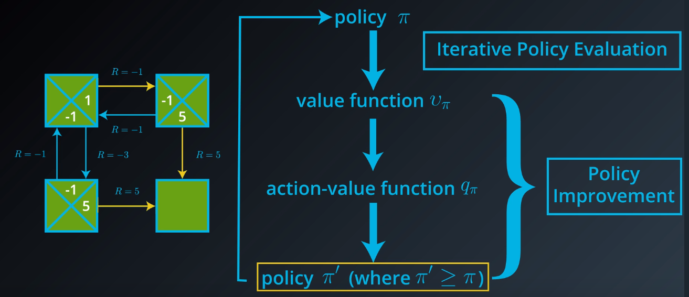
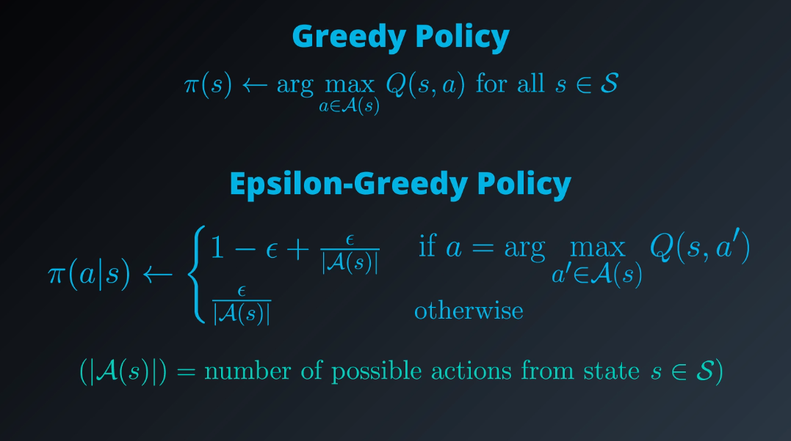
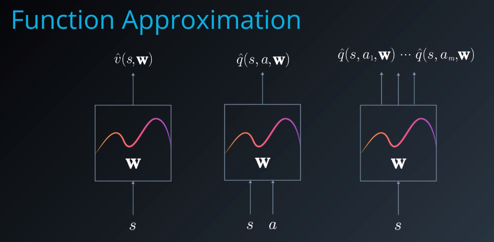
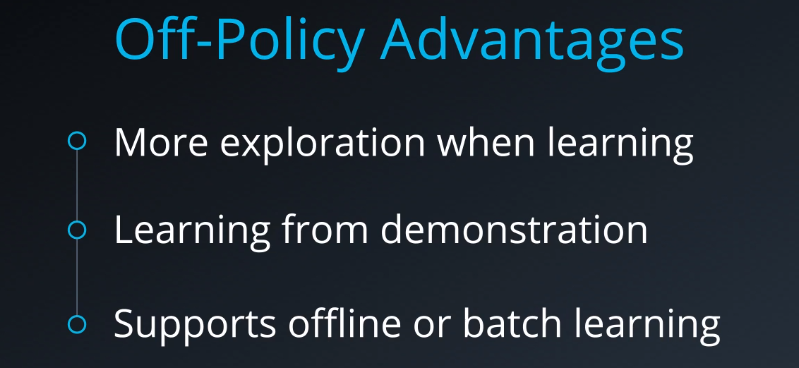
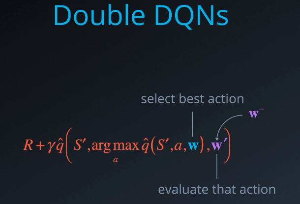

# Reinforcement Learning

## RL Framework: The Problem

### Abbreviations

- **Agent**: Learner or Decision Maker

### Optional Resources

- Read about [TD-Gammon](https://courses.cs.washington.edu/courses/cse590hk/01sp/Readings/tesauro95cacm.pdf), one of the first successful applications of neural networks to reinforcement learning.
- Read about [AlphaGo Zero](https://deepmind.com/blog/alphago-zero-learning-scratch/), the state-of-the-art computer program that defeats professional human Go players.
- Learn about how reinforcement learning (RL) is used to play [Atari games](https://deepmind.com/research/dqn/).
- Read about [OpenAI's bot](https://blog.openai.com/dota-2/) that beat the world’s top players of [Dota 2](http://www.dota2.com/play/).
- Read about [research](https://deepmind.com/blog/producing-flexible-behaviours-simulated-environments/) used to teach humanoid bodies to walk.
- Learn about RL for [self-driving cars](http://selfdrivingcars.mit.edu/).
- To see an example of RL applied to finance, check out this [final project](https://github.com/ucaiado/QLearning_Trading) from a student who graduated from the [Machine Learning Engineer Nanodegree](https://www.udacity.com/course/machine-learning-engineer-nanodegree--nd009). You may also enjoy this [friendly introduction](http://www.wildml.com/2018/02/introduction-to-learning-to-trade-with-reinforcement-learning/) to learning to trade with reinforcement learning.
- Learn about RL for [telecommunication](https://papers.nips.cc/paper/1740-low-power-wireless-communication-via-reinforcement-learning.pdf).
- Read [this paper](https://goo.gl/e3gaM2) that introduces RL for inventory management.

### Exploration-Exploitation Dilemma

- **Exploration**: Exploring potential hypotheses for how to choose actions
- **Exploitation**: Exploiting limited knowledge about what is already known should work well

**OpenAI** - https://github.com/openai/gym

**OpenAI Blog** - https://blog.openai.com/openai-gym-beta

**RL Book** - http://go.udacity.com/rl-textbook

**Python Implementation of RL** - https://github.com/ShangtongZhang/reinforcement-learning-an-introduction

**RL Cheat Sheet**- https://github.com/udacity/rl-cheatsheet/blob/master/cheatsheet.pdf

**Goal of the Agent**: Maximize expected cumulative reward

**Episodic Task**: Tasks with well defined ending point.

Agent learns over several episode. Each episode ends when certain end conditions are met. Agent has knowledge from previous episode to make better decisions in next episode.

**Continuing Task**: Task that goes on forever

### Playing Chess

------

Say you are an agent, and your goal is to play chess. At every time step, you choose any **action** from the set of possible moves in the game. Your opponent is part of the environment; she responds with her own move, and the **state** you receive at the next time step is the configuration of the board, when it’s your turn to choose a move again. The **reward** is only delivered at the end of the game, and, let’s say, is +1 if you win, and -1 if you lose.

This is an **episodic task**, where an episode finishes when the game ends. The idea is that by playing the game many times, or by interacting with the environment in many episodes, you can learn to play chess better and better.

It's important to note that this problem is exceptionally difficult, because the feedback is only delivered at the very end of the game. So, if you lose a game (and get a reward of -1 at the end of the episode), it’s unclear when exactly you went wrong: maybe you were so bad at playing that every move was horrible, or maybe instead … you played beautifully for the majority of the game, and then made only a small mistake at the end.

When the reward signal is largely uninformative in this way, we say that the task suffers the problem of *sparse rewards*. There’s an entire area of research dedicated to this problem, and you’re encouraged to read more about it, if it interests you.

**Ponder**:

- A **task** is an instance of the reinforcement learning (RL) problem.
- **Continuing tasks** are tasks that continue forever, without end.
- **Episodic tasks** are tasks with a well-defined starting and ending point.
  - In this case, we refer to a complete sequence of interaction, from start to finish, as an **episode**.
  - Episodic tasks come to an end whenever the agent reaches a **terminal state**.

**Reward Hypothesis**: All goals can be framed as the maximization of expected cumulative reward.

More about the research that was done at [DeepMind](https://deepmind.com/), please check out [this link](https://deepmind.com/blog/producing-flexible-behaviours-simulated-environments/). The research paper can be accessed [here](https://arxiv.org/pdf/1707.02286.pdf). Also, check out this cool [video](https://www.youtube.com/watch?v=hx_bgoTF7bs&feature=youtu.be)!

The **return** at time step **t** is 

**Discounted Return**

### MDP(Markov Decision Process)

In general, the state space **S** is the set of **all nonterminal states**.

In **continuing tasks**, this is equivalent to the set of **all states**.

In **episodic tasks**, we use **S+** to refer to the set of **all states, including terminal states**.

The action space **A** is the set of possible actions available to the agent.

In the event that there are some states where only a subset of the actions are available, we can also use **A(s)** to refer to the set of actions available in state **s∈S**.

# Summary

[The agent-environment interaction in reinforcement learning. (Source: Sutton and Barto, 2017)](https://classroom.udacity.com/nanodegrees/nd009-InMA2/parts/d7ec70b5-74d9-4749-93a7-0d6dc7aa4162/modules/734d40e7-acd2-472f-8864-3a8126cb6754/lessons/86acfc34-0551-4cc6-8de4-a1ab2e66b5af/concepts/ee28399b-f809-4e2b-936b-5a88d7297899#)

### The Setting, Revisited

------

- The reinforcement learning (RL) framework is characterized by an **agent** learning to interact with its **environment**.
- At each time step, the agent receives the environment's **state** (*the environment presents a situation to the agent)*, and the agent must choose an appropriate **action** in response. One time step later, the agent receives a **reward** (*the environment indicates whether the agent has responded appropriately to the state*) and a new **state**.
- All agents have the goal to maximize expected **cumulative reward**, or the expected sum of rewards attained over all time steps.

### Episodic vs. Continuing Tasks

------

- A **task** is an instance of the reinforcement learning (RL) problem.

- **Continuing tasks** are tasks that continue forever, without end.

- Episodic tasks

  are tasks with a well-defined starting and ending point.

  - In this case, we refer to a complete sequence of interaction, from start to finish, as an **episode**.
  - Episodic tasks come to an end whenever the agent reaches a **terminal state**.

### The Reward Hypothesis

------

- **Reward Hypothesis**: All goals can be framed as the maximization of (expected) cumulative reward.

### Goals and Rewards

------

- ​

### Cumulative Reward

------

- The **return at time step t** is G_t := R_{t+1} + R_{t+2} + R_{t+3} +…
- The agent selects actions with the goal of maximizing expected (discounted) return. (*Note: discounting is covered in the next concept.*)

### Discounted Return

------

- The **discounted return at time step tt** is G_t := R_{t+1} + \gamma R_{t+2} + \gamma^2 R_{t+3} + \ldotsGt:=Rt+1+γRt+2+γ2Rt+3+….
- The discount rate γ is something that you set, to refine the goal that you have the agent.
  - It must satisfy 0≤γ≤1.
  - If γ=0, the agent only cares about the most immediate reward.
  - If γ=1, the return is not discounted.
  - For larger values of γ, the agent cares more about the distant future. Smaller values of γ result in more extreme discounting, where - in the most extreme case - agent only cares about the most immediate reward.

### MDPs and One-Step Dynamics

------

- The **state space S** is the set of all (*nonterminal*) states.

- In episodic tasks, we use **S+** to refer to the set of all states, including terminal states.

- The **action space A** is the set of possible actions. (Alternatively, A(s) refers to the set of possible actions available in state s∈S.)

- (Please see **Part 2** to review how to specify the reward signal in the recycling robot example.)

- The **one-step dynamics** of the environment determine how the environment decides the state and reward at every time step. The dynamics can be defined by specifying **p(s′,r∣s,a)≐P(St+1=s′,Rt+1=r∣St=s,At=a)** for each possible s', r, s and a.

- A **(finite) Markov Decision Process (MDP)** is defined by:

  - a (finite) set of states S (or S+, in the case of an episodic task)
  - a (finite) set of actions \mathcal{A}A
  - a set of rewards R
  - the one-step dynamics of the environment
  - the discount rate γ∈[0,1]

  ​

## RL Framework: The Solution

**Deterministic Policy**: A mapping from set of environmental space to set of  possible actions.

**Stochastic Policy**: 

**State Value Function**

**Bellman Equation**:

**Optimality**: 

- An optimal policy is what an agent is looking for.
- It's solution to the MDP and best strategy to accomplish the goal.

**Action Value Function**:

Agent Interaction -> Optimal action value function -> Optimal policy

>  If the agent has optimal action vale function it can quickly obtain an optimal policy.

## Dynamic Programming

**One-step Dynamic of MDP**: It's defined by transition probabilities **p(s′,r∣s,a)≐P(St+1=s′,Rt+1=r∣St=s,At=a)**

### Iterative Policy Evaluation

#### Implementation: Iterative Policy Evaluation

The pseudo code for **iterative policy evaluation** can be found below.

Note that policy evaluation is guaranteed to converge to the state-value function vπ corresponding to a policy π, as long as vπ(s) is finite for each state s∈S. For a finite Markov decision process (MDP), this is guaranteed as long as either:

- γ<1, or
- if the agent starts in any state s∈S, it is guaranteed to eventually reach a terminal state if it follows policy π.

### Policy Improvement

The full pseudo code for **policy improvement** can be found below.

In the event that there is some state s∈S for which a∈A(s)Q(s,a) is not unique, there is some flexibility in how the improved policy π′ is constructed.

In fact, as long as the policy π′ satisfies for each s∈S and a∈A(s):

π′(a∣s)=0 if a∉argmaxa′∈A(s)  Q(s,a′),

it is an improved policy. In other words, any policy that (for each state) assigns zero probability to the actions that do not maximize the action-value function estimate (for that state) is an improved policy. 

### Policy Iteration

Policy iteration is guaranteed to find the optimal policy for any finite Markov decision process (MDP) in a finite number of iterations. The pseudo code can be found below.

### Truncated Policy Iteration

Whereas (iterative) policy evaluation applies as many Bellman updates as needed to attain convergence, truncated policy evaluation only performs a fixed number of sweeps through the state space.

The pseudo code can be found below.

We can incorporate this amended policy evaluation algorithm into an algorithm similar to policy iteration, called **truncated policy iteration**.

The pseudo code can be found below.

You may also notice that the stopping criterion for truncated policy iteration differs from that of policy iteration. In policy iteration, we terminated the loop when the policy was unchanged after a single policy improvement step. In truncated policy iteration, we stop the loop only when the value function estimate has converged.

You are strongly encouraged to try out both stopping criteria, to build your intuition. However, we note that checking for an unchanged policy is unlikely to work if the hyperparameter `max_iterations` is set too small. (To see this, consider the case that `max_iterations` is set to a small value. Then even if the algorithm is far from convergence to the optimal value function v_*or optimal policy π_∗, you can imagine that updates to the value function estimate VV may be too small to result in any updates to its corresponding policy.)

### Value Iteration

In this algorithm, each sweep over the state space effectively performs both policy evaluation and policy improvement. Value iteration is guaranteed to find the optimal policy π_* for any finite MDP.

The pseudo code can be found below.

Note that the stopping criterion is satisfied when the difference between successive value function estimates is sufficiently small. In particular, the loop terminates if the difference is less than θ for each state. And, the closer we want the final value function estimate to be to the optimal value function, the smaller we need to set the value of θ.

 For *more rigorous* guidelines on how exactly to set the value of θ, you might be interested in perusing [this paper](http://www.leemon.com/papers/1993wb2.pdf), where you are encouraged to pay particular attention to Theorem 3.2. Their main result of interest can be summarized as follows:

### Dynamic Programming Summary

[First step of policy iteration in gridworld example (Sutton and Barto, 2017)](https://classroom.udacity.com/nanodegrees/nd009-InMA2/parts/d7ec70b5-74d9-4749-93a7-0d6dc7aa4162/modules/734d40e7-acd2-472f-8864-3a8126cb6754/lessons/9cc18f72-766e-433e-a764-46338e09cf79/concepts/d7a2e040-96f2-4e2c-b8a3-d6ac6b0595a6#)

## Introduction

------

- In the **dynamic programming** setting, the agent has full knowledge of the MDP. (This is much easier than the **reinforcement learning** setting, where the agent initially knows nothing about how the environment decides state and reward and must learn entirely from interaction how to select actions.)

### An Iterative Method

------

- In order to obtain the state-value function v_\pivπ corresponding to a policy \piπ, we need only solve the system of equations corresponding to the Bellman expectation equation for v_\pivπ.
- While it is possible to analytically solve the system, we will focus on an iterative solution approach.

### Iterative Policy Evaluation

------

- **Iterative policy evaluation** is an algorithm used in the dynamic programming setting to estimate the state-value function v_\pivπ corresponding to a policy \piπ. In this approach, a Bellman update is applied to the value function estimate until the changes to the estimate are nearly imperceptible.

### Estimation of Action Values

------

- In the dynamic programming setting, it is possible to quickly obtain the action-value function q_\piqπ from the state-value function v_\pivπ with the equation: q_\pi(s,a) = \sum_{s'\in\mathcal{S}, r\in\mathcal{R}}p(s',r|s,a)(r+\gamma v_\pi(s'))qπ(s,a)=∑s′∈S,r∈Rp(s′,r∣s,a)(r+γvπ(s′)).

### Policy Improvement

------

- **Policy improvement** takes an estimate VV of the action-value function v_\pivπ corresponding to a policy \piπ, and returns an improved (or equivalent) policy \pi'π′, where \pi'\geq\piπ′≥π. The algorithm first constructs the action-value function estimate QQ. Then, for each state s\in\mathcal{S}s∈S, you need only select the action aa that maximizes Q(s,a)Q(s,a). In other words, \pi'(s) = \arg\max_{a\in\mathcal{A}(s)}Q(s,a)π′(s)=argmaxa∈A(s)Q(s,a) for all s\in\mathcal{S}s∈S.

### Policy Iteration

------

- **Policy iteration** is an algorithm that can solve an MDP in the dynamic programming setting. It proceeds as a sequence of policy evaluation and improvement steps, and is guaranteed to converge to the optimal policy (for an arbitrary *finite* MDP).

### Truncated Policy Iteration

------

- **Truncated policy iteration** is an algorithm used in the dynamic programming setting to estimate the state-value function v_\pivπ corresponding to a policy \piπ. In this approach, the evaluation step is stopped after a fixed number of sweeps through the state space. We refer to the algorithm in the evaluation step as **truncated policy evaluation**.

### Value Iteration

------

- **Value iteration** is an algorithm used in the dynamic programming setting to estimate the state-value function v_\pivπ corresponding to a policy \piπ. In this approach, each sweep over the state space simultaneously performs policy evaluation and policy improvement.

## Monte Carlo Methods

------

**Implementation: MC Prediction (State Values)**

The pseudo code for (first-visit) MC prediction (for the state values) can be found below.  (*Feel free to implement either the first-visit or every-visit MC method.  In the game of Blackjack, both the first-visit and every-visit methods return identical results.*)

If
 you are interested in learning more about the difference between 
first-visit and every-visit MC methods, you are encouraged to read 
Section 3 of [this paper](http://www-anw.cs.umass.edu/legacy/pubs/1995_96/singh_s_ML96.pdf).
Their results are summarized in Section 3.6.  The authors show:

- Every-visit MC is [biased](https://en.wikipedia.org/wiki/Bias_of_an_estimator), whereas first-visit MC is unbiased (see Theorems 6 and 7).
- Initially, every-visit MC has lower [mean squared error (MSE)](https://en.wikipedia.org/wiki/Mean_squared_error), but as more episodes are collected, first-visit MC attains better MSE (see Corollary 9a and 10a, and Figure 4).

Both the first-visit and every-visit method are **guaranteed to converge** to the true value function, as the number of visits to each state approaches infinity.  (*So, in other words, as long as the agent gets enough experience with each state, the value function estimate will be pretty close to the true value.*)  In the case of first-visit MC, convergence follows from the [Law of Large Numbers](https://en.wikipedia.org/wiki/Law_of_large_numbers), and the details are covered in section 5.1 of the [textbook](http://go.udacity.com/rl-textbook).

**Remember**: For every state the reward is calculated as

 - for each episode 
    - sum **discounted** reward of all the state that follows
 - average out the sum with number of episode

**Implementation: MC Prediction (Action Values)**

The pseudo code for (first-visit) MC prediction (for the action values) can be found below.  (*Feel free to implement either the first-visit or every-visit MC method.  In the game of Blackjack, both the first-visit and every-visit methods return identical results.*)

Both the first-visit and every-visit methods are **guaranteed to converge** to the true value function, as the number of visits to each state-action pair approaches infinity.  (*So, in other words, as long as the agent gets enough experience with each state-action pair, the value function estimate will be pretty close to the true value.*)

We won't use MC prediction to estimate the action-values corresponding to a deterministic policy; this is because many state-action pairs will *never* be visited (since a deterministic policy always chooses the *same* action from each state).  Instead, so that convergence is guaranteed, we will only estimate action-value functions corresponding to policies where each action has a nonzero probability of being selected from each state.

### Generalized Policy iteration

### Incremental Mean

### Policy Evaluation

### Policy Improvement

We can think of the agent who follows an \epsilonϵ-greedy policy as always having a (potentially unfair) coin at its disposal, with probability ϵ of landing heads. After observing a state, the agent flips the coin.

- If the coin lands tails (so, with probability 1−ϵ), the agent selects the greedy action.
- If the coin lands heads (so, with probability ϵ), the agent selects an action *uniformly* at random from the set of available (non-greedy **AND** greedy) actions.

In order to construct a policy π that is ϵ-greedy with respect to the current action-value function estimate QQ, we need only set

for each s∈S and a∈A(s). Note that ϵ must always be a value between 0 and 1, inclusive (that is, ϵ∈[0,1]).

### Exploration vs Exploitation

[Deck](http://slides.com/ericmoura/deck-2/embed)

## Exploration-Exploitation Dilemma

------

Recall that the environment's dynamics are initially unknown to the agent. Towards maximizing return, the agent must learn about the environment through interaction.

At every time step, when the agent selects an action, it bases its decision on past experience with the environment. And, towards minimizing the number of episodes needed to solve environments in OpenAI Gym, our first instinct could be to devise a strategy where the agent always selects the action that it believes (*based on its past experience*) will maximize return. With this in mind, the agent could follow the policy that is greedy with respect to the action-value function estimate. We examined this approach in a previous video and saw that it can easily lead to convergence to a sub-optimal policy.

To see why this is the case, note that in early episodes, the agent's knowledge is quite limited (and potentially flawed). So, it is highly likely that actions *estimated* to be non-greedy by the agent are in fact better than the *estimated* greedy action.

With this in mind, a successful RL agent cannot act greedily at every time step (*that is*, it cannot always **exploit** its knowledge); instead, in order to discover the optimal policy, it has to continue to refine the estimated return for all state-action pairs (*in other words*, it has to continue to **explore** the range of possibilities by visiting every state-action pair). That said, the agent should always act *somewhat greedily*, towards its goal of maximizing return *as quickly as possible*. This motivated the idea of an \epsilonϵ-greedy policy.

We refer to the need to balance these two competing requirements as the **Exploration-Exploitation Dilemma**. One potential solution to this dilemma is implemented by gradually modifying the value of ϵ when constructing ϵ-greedy policies.

## Setting the Value of ϵ, in Theory

------

It makes sense for the agent to begin its interaction with the environment by favoring **exploration** over **exploitation**. After all, when the agent knows relatively little about the environment's dynamics, it should distrust its limited knowledge and **explore**, or try out various strategies for maximizing return. With this in mind, the best starting policy is the equiprobable random policy, as it is equally likely to explore all possible actions from each state. You discovered in the previous quiz that setting ϵ=1 yields an \epsilonϵ-greedy policy that is equivalent to the equiprobable random policy.

At later time steps, it makes sense to favor **exploitation** over **exploration**, where the policy gradually becomes more greedy with respect to the action-value function estimate. After all, the more the agent interacts with the environment, the more it can trust its estimated action-value function. You discovered in the previous quiz that setting ϵ=0 yields the greedy policy (or, the policy that most favors exploitation over exploration).

Thankfully, this strategy (of initially favoring exploration over exploitation, and then gradually preferring exploitation over exploration) can be demonstrated to be optimal.

## Greedy in the Limit with Infinite Exploration (GLIE)

------

In order to guarantee that MC control converges to the optimal policy π_∗, we need to ensure that two conditions are met. We refer to these conditions as **Greedy in the Limit with Infinite Exploration (GLIE)**. In particular, if:

- every state-action pair s, as,a (for all s∈S and a∈A(s)) is visited infinitely many times, and
- the policy converges to a policy that is greedy with respect to the action-value function estimate QQ,

then MC control is guaranteed to converge to the optimal policy (in the limit as the algorithm is run for infinitely many episodes). These conditions ensure that:

- the agent continues to explore for all time steps, and
- the agent gradually exploits more (and explores less).

One way to satisfy these conditions is to modify the value of ϵ when specifying an ϵ-greedy policy. In particular, let ϵ_i correspond to the i-th time step. Then, both of these conditions are met if:

- ϵ_i>0 for all time steps ii, and

- ϵ_i decays to zero in the limit as the time step ii approaches infinity (that is, 
  $$
  \lim_{i\to\infty} \epsilon_i = 0
  $$
  ).

For example, to ensure convergence to the optimal policy, we could set 
$$
\epsilon_i = \frac{1}{i}
$$
. (You are encouraged to verify that ϵ_i>0 for all ii, and 
$$
\lim_{i\to\infty} \epsilon_i = 0
$$
.)

## Setting the Value of ϵ, in Practice

------

As you read in the above section, in order to guarantee convergence, we must let ϵ_i decay in accordance with the GLIE conditions. But sometimes "guaranteed convergence" *isn't good enough* in practice, since this really doesn't tell you how long you have to wait! It is possible that you could need trillions of episodes to recover the optimal policy, for instance, and the "guaranteed convergence" would still be accurate!

> Even though convergence is **not** guaranteed by the mathematics, you can often get better results by either:
>
> - using fixed ϵ, or
> - letting ϵ_i decay to a small positive number, like 0.1.

This is because one has to be very careful with setting the decay rate for ϵ; letting it get too small too fast can be disastrous. If you get late in training and ϵ is really small, you pretty much want the agent to have already converged to the optimal policy, as it will take way too long otherwise for it to test out new actions!

As a famous example in practice, you can read more about how the value of ϵ was set in the famous DQN algorithm by reading the Methods section of [the research paper](https://storage.googleapis.com/deepmind-media/dqn/DQNNaturePaper.pdf):

> *The behavior policy during training was epsilon-greedy with epsilon annealed linearly from 1.0 to 0.1 over the first million frames, and fixed at 0.1 thereafter.*

### **Implementation: MC Control: GLIE**

------

The pseudo code for (first-visit) GLIE MC control can be found below. (*Feel free to implement either the first-visit or every-visit MC method. In the game of Blackjack, both the first-visit and every-visit methods return identical results.*)

### MC Control with constant alpha 

The analogous pseudocode (for taking a *forgetful* mean of a sequence (x_1, x_2, \ldots, x_n)(x1,x2,…,xn)) can be found below.

## Setting the Value of α

Remember that the `forgetful_mean` function is closely related to the **Evaluation** step in constant-α MC control. You can find the associated pseudo code below.

Before moving on to the next concept, use the above coding environment to verify the following facts about about how to set the value of α when implementing constant-α MC control.

- You should always set the value for α to a number greater than zero and less than (or equal to) one.
  - If α=0, then the action-value function estimate is never updated by the agent.
  - If 
    α=1, then the final value estimate for each state-action pair is always equal to the last return that was experienced by the agent (after visiting the pair).
- Smaller values for \alphaα encourage the agent to consider a longer history of returns when calculating the action-value function estimate. Increasing the value of \alphaα ensures that the agent focuses more on the most recently sampled returns.

Note that it is also possible to verify the above facts by slightly rewriting the update step as follows:
$$
Q(S_t,A_t) \leftarrow (1-\alpha)Q(S_t,A_t) + \alpha G_tQ(St,At)←(1−α)Q(St,At)+αGt
$$
where it is now more obvious that \alphaα controls how much the agent trusts the most recent return 
$$
G_t
$$
 over the estimate 
$$
Q(S_t,A_t)Q(St,At)
$$
 constructed by considering all past returns.

**IMPORTANT NOTE**: It is important to mention that when implementing constant-\alphaα MC control, you must be careful to not set the value of \alphaα too close to 1. This is because very large values can keep the algorithm from converging to the optimal policy \pi_*π∗. However, you must also be careful to not set the value of α too low, as this can result in an agent who learns too slowly. The best value of \alphaα for your implementation will greatly depend on your environment and is best gauged through trial-and-error.

### Implementation: MC Control: Constant-alpha

The pseudo code for (first-visit) constant-α MC control can be found below. (*Feel free to implement either the first-visit or every-visit MC method. In the game of Blackjack, both the first-visit and every-visit methods return identical results.*)

# Monte Carlo Summary

[Optimal policy and state-value function in blackjack (Sutton and Barto, 2017)](https://classroom.udacity.com/nanodegrees/nd009-InMA2/parts/d7ec70b5-74d9-4749-93a7-0d6dc7aa4162/modules/734d40e7-acd2-472f-8864-3a8126cb6754/lessons/4894b062-f2ed-4f31-95bc-f28a90f7acff/concepts/8c9f974e-e90c-4136-a4e9-f8b3b697bdaf#)

## MC Prediction: State Values

------

- Algorithms that solve the **prediction problem** determine the value function v_\pivπ (or q_\piqπ) corresponding to a policy \piπ.

- Methods that evaluate a policy

  \piπ

   

  from interaction with the environment fall under one of two categories:

  - **On-policy** methods have the agent interact with the environment by following the same policy \piπthat it seeks to evaluate (or improve).
  - **Off-policy** methods have the agent interact with the environment by following a policy bb (where b\neq\pib≠π) that is different from the policy that it seeks to evaluate (or improve).

- Each occurrence of state s\in\mathcal{S}s∈S in an episode is called a **visit to ss**.

- There are two types of Monte Carlo (MC) prediction methods (for estimating

  v_\pivπ

  ):

  - **First-visit MC** estimates v_\pi(s)vπ(s) as the average of the returns following *only first* visits to ss (that is, it ignores returns that are associated to later visits).
  - **Every-visit MC** estimates v_\pi(s)vπ(s) as the average of the returns following *all* visits to ss.

## MC Prediction: Action Values

------

- Each occurrence of the state-action pair s,as,a (s\in\mathcal{S},a\in\mathcal{A}s∈S,a∈A) in an episode is called a **visit to s,as,a**.

- There are two types of MC prediction methods (for estimating

  q_\piqπ

  ):

  - **First-visit MC** estimates q_\pi(s,a)qπ(s,a) as the average of the returns following *only first* visits to s,as,a(that is, it ignores returns that are associated to later visits).
  - **Every-visit MC** estimates q_\pi(s,a)qπ(s,a) as the average of the returns following *all* visits to s,as,a.

## Generalized Policy Iteration

------

- Algorithms designed to solve the **control problem** determine the optimal policy \pi_*π∗ from interaction with the environment.
- **Generalized policy iteration (GPI)** refers to the general method of using alternating rounds of policy evaluation and improvement in the search for an optimal policy, All of the reinforcement learning algorithms we examine in this course can be classified as GPI.

## MC Control: Incremental Mean

------

- (In this concept, we derived an algorithm that keeps a running average of a sequence of numbers.)

## MC Control: Policy Evaluation

------

- (In this concept, we amended the policy evaluation step to update the value function after every episode of interaction.)

## MC Control: Policy Improvement

------

- A policy is **greedy** with respect to an action-value function estimate QQ if for every state s\in\mathcal{S}s∈S, it is guaranteed to select an action a\in\mathcal{A}(s)a∈A(s) such that a = \arg\max_{a\in\mathcal{A}(s)}Q(s,a)a=argmaxa∈A(s)Q(s,a). (It is common to refer to the selected action as the **greedy action**.)

- A policy is

  \epsilonϵ-greedy

   

  with respect to an action-value function estimate

   

  QQ

   

  if for every state

   

  s\in\mathcal{S}s∈S

  ,

  - with probability 1-\epsilon1−ϵ, the agent selects the greedy action, and
  - with probability \epsilonϵ, the agent selects an action (uniformly) at random.

## Exploration vs. Exploitation

------

- All reinforcement learning agents face the **Exploration-Exploitation Dilemma**, where they must find a way to balance the drive to behave optimally based on their current knowledge (**exploitation**) and the need to acquire knowledge to attain better judgment (**exploration**).

- In order for MC control to converge to the optimal policy, the

  Greedy in the Limit with Infinite Exploration (GLIE)

   

  conditions must be met:

  - every state-action pair s, as,a (for all s\in\mathcal{S}s∈S and a\in\mathcal{A}(s)a∈A(s)) is visited infinitely many times, and
  - the policy converges to a policy that is greedy with respect to the action-value function estimate QQ.

## MC Control: Constant-alpha

------

- (In this concept, we derived the algorithm for **constant-\alphaα MC control**, which uses a constant step-size parameter \alphaα.)
- The step-size parameter \alphaα must satisfy 0 < \alpha \leq 10<α≤1. Higher values of \alphaα will result in faster learning, but values of \alphaα that are too high can prevent MC control from converging to \pi_*π∗.

## Temporal Difference(TD Learning)

### Implementation: TD(0)

The pseudo code for TD(0) (or one-step TD) can be found below.

TD(0) is **guaranteed to converge** to the true state-value function, as long as the step-size parameter α is sufficiently small. If you recall, this was also the case for constant-α MC prediction. However, TD(0) has some nice advantages:

- Whereas MC prediction must wait until the end of an episode to update the value function estimate, TD prediction methods update the value function after every time step. Similarly, TD prediction methods work for continuous and episodic tasks, while MC prediction can only be applied to episodic tasks.
- In practice, TD prediction converges faster than MC prediction. (*That said, no one has yet been able to prove this, and it remains an open problem.*) You are encouraged to take the time to check this for yourself in your implementations! For an example of how to run this kind of analysis, check out Example 6.2 in the [textbook](http://go.udacity.com/rl-textbook).

### TD Control

**Implementation: Sarsa(0)**

The pseudo code for Sarsa (or Sarsa(0)) can be found below.

Sarsa(0) is **guaranteed to converge** to the optimal action-value function, as long as the step-size parameter α is sufficiently small, and the **Greedy in the Limit with Infinite Exploration (GLIE)** conditions are met. The GLIE conditions were introduced in the previous lesson, when we learned about MC control. Although there are many ways to satisfy the GLIE conditions, one method involves gradually decaying the value of ϵ when constructing ϵ-greedy policies.

In particular, let \epsilon_iϵi correspond to the ii-th time step. Then, if we set ϵ_i such that:

- ϵ_i>0 for all time steps ii, and
- ϵi decays to zero in the limit as the time step ii approaches infinity (that is, limi→∞ϵ_i=0),

then the algorithm is guaranteed to yield a good estimate for q_*q∗, as long as we run the algorithm for long enough. A corresponding optimal policy \pi_*π∗ can then be quickly obtained by setting 
$$
\pi_*(s) = \arg\max_{a\in\mathcal{A}(s)} q_*(s, a)
$$
for all s∈S.

### TD Control: Sarsamax(Q-Learning)

[research paper](http://citeseerx.ist.psu.edu/viewdoc/download?doi=10.1.1.80.7501&rep=rep1&type=pdf) that proves that Sarsamax (or *Q*-learning) converges.

**Implementation: Sarsamax**

The pseudo code for Sarsamax (or *Q*-learning) can be found below.

Sarsamax is **guaranteed to converge** under the same conditions that guarantee convergence of Sarsa.

### TD Control: Expected Sarsa

**Implementation: Expected Sarsa**

The pseudocode for Expected Sarsa can be found below.

Expected Sarsa is **guaranteed to converge** under the same conditions that guarantee convergence of Sarsa and Sarsamax.

Remember that **theoretically**, the as long as the step-size parameter \alphaα is sufficiently small, and the **Greedy in the Limit with Infinite Exploration (GLIE)** conditions are met, the agent is guaranteed to eventually discover the optimal action-value function (and an associated optimal policy). 

### Analyzing Performance

All of the TD control algorithms we have examined (Sarsa, Sarsamax, Expected Sarsa) converge to the optimal action-value function q_*q∗ (and so yield the optimal policy \pi_*π∗) if (1) the value of \epsilonϵ decays in accordance with the GLIE conditions, and (2) the step-size parameter \alphaα is sufficiently small.

The differences between these algorithms are summarized below:

- Sarsa and Expected Sarsa are both **on-policy** TD control algorithms. In this case, the same (\epsilonϵ-greedy) policy that is evaluated and improved is also used to select actions.
- Sarsamax is an **off-policy** method, where the (greedy) policy that is evaluated and improved is different from the (\epsilonϵ-greedy) policy that is used to select actions.
- On-policy TD control methods (like Expected Sarsa and Sarsa) have better online performance than off-policy TD control methods (like Sarsamax).
- Expected Sarsa generally achieves better performance than Sarsa.

If you would like to learn more, you are encouraged to read Chapter 6 of the [textbook](http://go.udacity.com/rl-textbook) (especially sections 6.4-6.6).

As an optional exercise to deepen your understanding, you are encouraged to reproduce Figure 6.4. (Note that this exercise is optional!)

The figure shows the performance of Sarsa and Q-learning on the cliff walking environment for constant ϵ=0.1. As described in the textbook, in this case,

- Q-learning achieves worse online performance (where the agent collects less reward on average in each episode), but learns the optimal policy, and
- Sarsa achieves better online performance, but learns a sub-optimal "safe" policy.

### Temporal Difference: Summary

[The cliff-walking task (Sutton and Barto, 2017)](https://classroom.udacity.com/nanodegrees/nd009-InMA2/parts/d7ec70b5-74d9-4749-93a7-0d6dc7aa4162/modules/734d40e7-acd2-472f-8864-3a8126cb6754/lessons/d2de57a0-cd89-40bd-b87f-ec0298b425cf/concepts/7d2dafe6-e522-4a8d-beb0-e9dd6eadddfc#)

**TD Prediction: TD(0)**

------

- Whereas Monte Carlo (MC) prediction methods must wait until the end of an episode to update the value function estimate, temporal-difference (TD) methods update the value function after every time step.
- For any fixed policy, **one-step TD** (or **TD(0)**) is guaranteed to converge to the true state-value function, as long as the step-size parameter \alphaα is sufficiently small.
- In practice, TD prediction converges faster than MC prediction.

**TD Prediction: Action Values**

------

- (In this concept, we discussed a TD prediction algorithm for estimating action values. Similar to TD(0), this algorithm is guaranteed to converge to the true action-value function, as long as the step-size parameter \alphaα is sufficiently small.)

**TD Control: Sarsa(0)**

------

- **Sarsa(0)** (or **Sarsa**) is an on-policy TD control method. It is guaranteed to converge to the optimal action-value function q_*q∗, as long as the step-size parameter \alphaα is sufficiently small and \epsilonϵ is chosen to satisfy the **Greedy in the Limit with Infinite Exploration (GLIE)** conditions.

**TD Control: Sarsamax**

------

- **Sarsamax** (or **Q-Learning**) is an off-policy TD control method. It is guaranteed to converge to the optimal action value function q_*q∗, under the same conditions that guarantee convergence of the Sarsa control algorithm.

**TD Control: Expected Sarsa**

------

- **Expected Sarsa** is an on-policy TD control method. It is guaranteed to converge to the optimal action value function q_*q∗, under the same conditions that guarantee convergence of Sarsa and Sarsamax.

**Analyzing Performance**

------

- On-policy TD control methods (like Expected Sarsa and Sarsa) have better online performance than off-policy TD control methods (like Q-learning).
- Expected Sarsa generally achieves better performance than Sarsa.

## Deep Reinforcement Learning

### Discrete vs Continuous Spaces

**Discrete Spaces**

- States : 

  ​
  $$
  s\in\mathcal{S_0 , S_1, ..., Sn}
  $$

- Actions: 

$$
a\in\mathcal{A_0, A_1, ..., An}
$$

### Discretization

### Tile Coding

### Coarse Coding

### Function Approximation

### Linear Function Approximation

### kernel Functions

### Non-Linear Function Approximation

## Deep Q-Learning

### Neural Nets as Value Functions

### Temporal Difference Learning

### Q-Learning

**Note**: One drawback of both SARSA & Q-Learning, since they are TD approaches, is that they may not converge on the global optimum when using non-linear function approximation.

**Readings**

- Rahimi & Recht, 2007. [Random Features for Large-Scale Kernel Machines](https://classroom.udacity.com/nanodegrees/nd009-InMA2/parts/d7ec70b5-74d9-4749-93a7-0d6dc7aa4162/modules/b07f69ce-6a40-40fd-8865-2c956ef1454a/lessons/2faec296-1a78-4393-9aea-2b91310713ed/concepts/www.robots.ox.ac.uk/~vgg/rg/papers/randomfeatures.pdf).
  Presents an efficient approximation to RBF-like kernel transforms.

### Deep Q-Netowrk

### Experience Replay

**Readings**

- Long-Ji Lin, 1993. [Reinforcement learning for robots using neural networks](https://pdfs.semanticscholar.org/54c4/cf3a8168c1b70f91cf78a3dc98b671935492.pdf).

### Fixed Q-Targets

Mathematically Incorrect

Ever wondered how this would look in real life? See: [Carrot Stick Riding](https://www.youtube.com/watch?v=-PVFBGN_zoM).

### Deep Q-Learning Algorithm

**Readings**

- Mnih et al., 2015. [Human-level control through deep reinforcement learning](https://storage.googleapis.com/deepmind-media/dqn/DQNNaturePaper.pdf). (DQN paper)
- He et al., 2015. [Delving Deep into Rectifiers: Surpassing Human-Level Performance on ImageNet Classification](https://arxiv.org/abs/1502.01852). (weight initialization)

### DQN Improvements

- Double DQN
- Prioritized Replay
- Dueling Networks

**Readings**

- Thrun & Schwartz, 1993. [Issues in Using Function Approximation for Reinforcement Learning](http://citeseerx.ist.psu.edu/viewdoc/summary?doi=10.1.1.73.3097). (overestimation of Q-values)
- van Hasselt et al., 2015. [Deep Reinforcement Learning with Double Q-Learning](https://arxiv.org/abs/1509.06461).
- Schaul et al., 2016. [Prioritized Experience Replay](https://arxiv.org/abs/1511.05952).
- Wang et al., 2015. [Dueling Network Architectures for Deep Reinforcement Learning](https://arxiv.org/abs/1511.06581).
- Hausknecht & Stone, 2015. [Deep Recurrent Q-Learning for Partially Observable MDPs](https://arxiv.org/abs/1507.06527).

### Implementing Deep Q-Learning

Check out Python framework implementations:

- (Keras) <https://keon.io/deep-q-learning/>
- (PyTorch) <http://pytorch.org/tutorials/intermediate/reinforcement_q_learning.html>

## Policy-Based Methods

**Why**:

- Simplicity
- Stochastic Policies
- Continuous Action Space

> Value based approach tends to learn a deterministic or near deterministic policy whereas a policy based approach situation might learn the desired stochastic policy.

### Policy function Approximation

### Stochastic Policy Search(Hill Climbing)

### Policy Gradients

### Monte Carlo Policy Gradients

### Constrained Policy Gradients

## Actor-Critic Methods

**Advantage Function**

**Actor-Critic Advantage Function**

**Research Areas**

