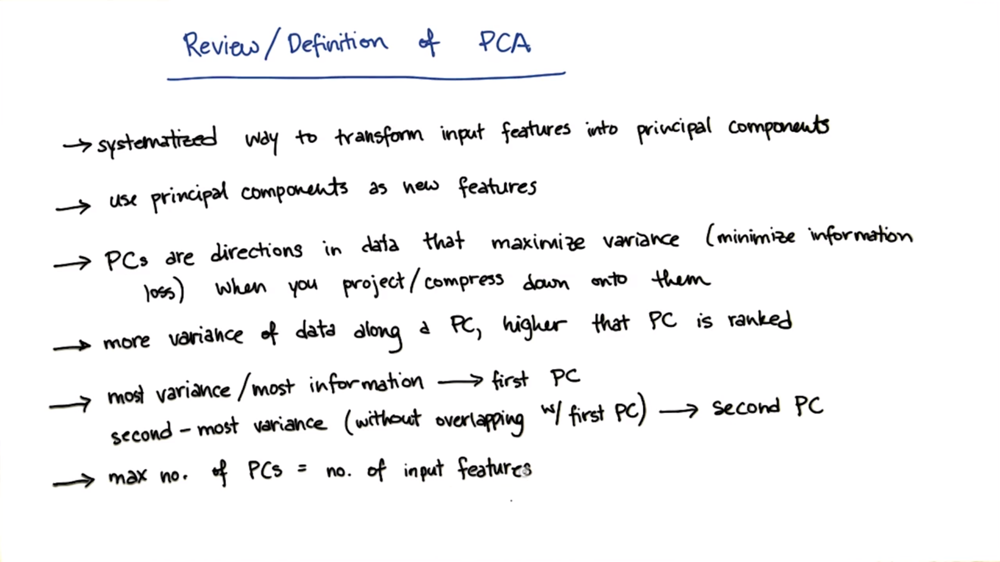

# Unsupervised Machine Learning

## Clustering

### K-Means

**K-Means** works in two steps

- Assign: Assign each data points to a cluster center
- Optimize: minimize the squared error distance between cluster center and data points assigned to it

[Visualize K-Means](https://www.naftaliharris.com/blog/visualizing-k-means-clustering/)

**K-Means** is also called **Hill Climbing** algorithm		

### SLC(Single Linkage Clustering)

- Consider each object a cluster(n objects)
- Define inter-cluster distance as the distance between two clusters
- Merge two closest clusters
- Repeat **n-k** times to make **k clusters**.

**Hierarchical Agglomerative Structure**

If we cut the **HAS** at top we almost get three cluster.

### Soft Clustering

Assume the data was generated by

- Select one of K Gaussians(Fixed known variance) uniformly
- Sample Xi from that Gaussian
- Repeat n times

**Task**: Find a hypothesis h = < u1, u2, ..., uk> that maximizes the probability of data(**M**aximum **L**ikelihood)

**Maximum Likelihood Gaussian** 

- Expectation 	
- Maximization

##### Clustering properties

- Richness
- Scale-invariance
- Consistency

##### Impossibility Theorem(Kleinberg)

No clustering scheme can achieve all three of:

- Richness
- Scale Invariance
- Consistency

## Feature Scaling

- X' = (X - Xmin)/(Xmax - Xmin)

## Feature Selection

- Knowledge Discovery
  - Interpretability
  - Insight
- Curse of Dimensionality: As you add more features, you exponentially need more data  to fill out the space(the amount of data you need grows exponentially in the number of features you have)

**Feature Selection Algorithm**:

- Filtering
- Wrapping

##### Relevance

## PCA(Principal Component Analysis)

### How to determine Principal Component

- **Variance**: Spread of data in a distribution
- **Principal Component** of a dataset is in the direction that has the **largest variance** because it retains the maximum amount of `information` in original data

> Project onto direction of maximal variance `minimizes distance`  form old (higher-dimensional) data point to it's new transformed value.
>
> - Minimizes information loss

### When to use PCA

- Latent features driving patterns in data
- Dimensionality Reduction
  - Visualize high dimensional data
  - Reduce noise
  - Make other algorithms(regression, classification) work better because fewer inputs(eigenfaces)